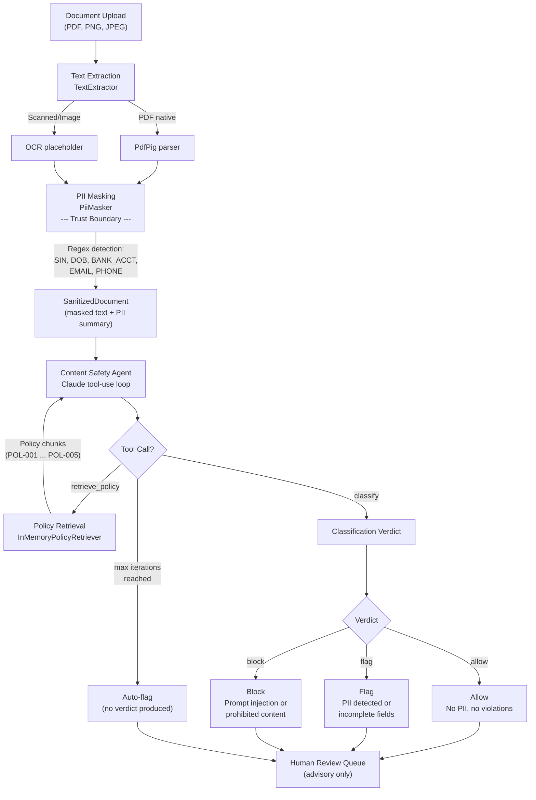

# Content Safety Gate - Workflow

```mermaid
flowchart TD
    A["Document Upload\n(PDF, PNG, JPEG)"] --> B["Text Extraction\nTextExtractor"]
    B -->|PDF native| B1[PdfPig parser]
    B -->|Scanned/Image| B2[OCR placeholder]
    B1 --> C
    B2 --> C

    C["PII Masking\nPiiMasker\n--- Trust Boundary ---"]
    C -->|"Regex detection:\nSIN, DOB, BANK_ACCT,\nEMAIL, PHONE"| D["SanitizedDocument\n(masked text + PII summary)"]

    D --> E["Content Safety Agent\nClaude tool-use loop"]

    E --> F{Tool Call?}
    F -->|retrieve_policy| G["Policy Retrieval\nInMemoryPolicyRetriever"]
    G -->|"Policy chunks\n(POL-001 ... POL-005)"| E

    F -->|classify| H["Classification Verdict"]

    F -->|"max iterations\nreached"| I["Auto-flag\n(no verdict produced)"]

    H --> J{Verdict}
    J -->|allow| K["Allow\nNo PII, no violations"]
    J -->|flag| L["Flag\nPII detected or\nincomplete fields"]
    J -->|block| M["Block\nPrompt injection or\nprohibited content"]

    K --> N["Human Review Queue\n(advisory only)"]
    L --> N
    M --> N
    I --> N
```
