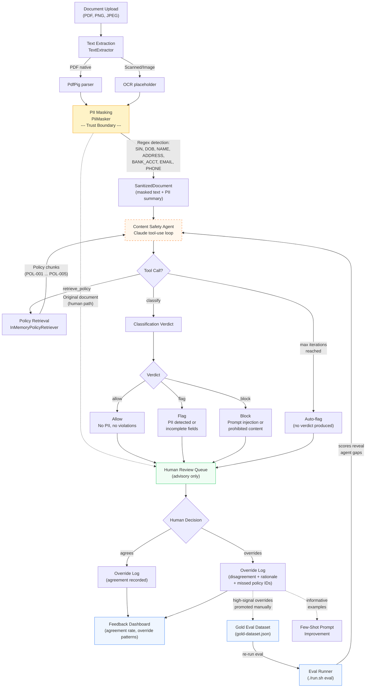

# Content Safety Gate - Workflow

```mermaid
flowchart TD
    A["Document Upload\n(PDF, PNG, JPEG)"] --> B["Text Extraction\nTextExtractor"]
    B -->|PDF native| B1[PdfPig parser]
    B -->|Scanned/Image| B2[OCR placeholder]
    B1 --> C
    B2 --> C

    C["PII Masking\nPiiMasker\n--- Trust Boundary ---"]
    C -->|"Regex detection:\nSIN, DOB, NAME, ADDRESS,\nBANK_ACCT, EMAIL, PHONE"| D["SanitizedDocument\n(masked text + PII summary)"]

    C -.->|"Original document\n(human path)"| HQ

    D --> E["Content Safety Agent\nClaude tool-use loop"]

    E --> F{Tool Call?}
    F -->|retrieve_policy| G["Policy Retrieval\nInMemoryPolicyRetriever"]
    G -->|"Policy chunks\n(POL-001 ... POL-005)"| E

    F -->|classify| H["Classification Verdict"]

    F -->|"max iterations\nreached"| I["Auto-flag\n(no verdict produced)"]

    H --> J{Verdict}
    J -->|allow| K["Allow\nNo PII, no violations"]
    J -->|flag| L["Flag\nPII detected or\nincomplete fields"]
    J -->|block| M["Block\nPrompt injection or\nprohibited content"]

    K --> HQ["Human Review Queue\n(advisory only)"]
    L --> HQ
    M --> HQ
    I --> HQ

    HQ --> R{Human Decision}
    R -->|agrees| S["Override Log\n(agreement recorded)"]
    R -->|overrides| T["Override Log\n(disagreement + rationale\n+ missed policy IDs)"]

    S --> FB["Feedback Dashboard\n(agreement rate, override patterns)"]
    T --> FB
    T -.->|"high-signal overrides\npromoted manually"| GD["Gold Eval Dataset\n(gold-dataset.json)"]
    T -.->|"informative\nexamples"| FP["Few-Shot Prompt\nImprovement"]

    GD -->|"re-run eval"| EVAL["Eval Runner\n(./run.sh eval)"]
    EVAL -->|"scores reveal\nagent gaps"| E

    style C fill:#fef3c7,stroke:#f59e0b
    style E fill:#fff7ed,stroke:#f97316,stroke-dasharray: 5 5
    style HQ fill:#f0fdf4,stroke:#22c55e
    style FB fill:#eff6ff,stroke:#3b82f6
    style GD fill:#eff6ff,stroke:#3b82f6
    style EVAL fill:#eff6ff,stroke:#3b82f6
```
